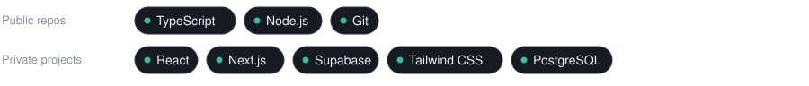

<picture>
  <source media="(prefers-color-scheme: dark)" srcset="assets/banner-dark.svg">
  <source media="(prefers-color-scheme: light)" srcset="assets/banner-light.svg">
  
</picture>

[English](README.md) · **Français**

<picture>
  <source media="(prefers-color-scheme: dark)" srcset="assets/typing-dark.svg">
  <source media="(prefers-color-scheme: light)" srcset="assets/typing-light.svg">
  
</picture>

## À propos

Développeur full-stack au Maroc. Je construis des applications web avec Next.js, TypeScript et Supabase, de la base de données à l'interface.

Architecture propre, sécurité des types et UX soignée. Du travail petit mais utile plutôt que de vagues promesses.

Disponible pour des projets freelance.

## Stack

<picture>
  <source media="(prefers-color-scheme: dark)" srcset="assets/stack-dark.svg">
  <source media="(prefers-color-scheme: light)" srcset="assets/stack-light.svg">
  
</picture>

## En cours

### [morocco-kit](https://github.com/Saf1thedev/morocco-kit) · [v0.1.0](https://github.com/Saf1thedev/morocco-kit/releases/tag/v0.1.0)

Boîte à outils TypeScript open source pour le Maroc : validation des numéros de téléphone, jours fériés, régions administratives et formatage du MAD. Zéro dépendance, chaque règle est rattachée à une source officielle.

```bash
npm i github:Saf1thedev/morocco-kit#v0.1.0
```

<!-- TODO : ajouter le lien vers la documentation et le playground une fois le site déployé. -->

## Activité

<picture>
  <source media="(prefers-color-scheme: dark)" srcset="graphs/activity-dark.svg">
  <source media="(prefers-color-scheme: light)" srcset="graphs/activity-light.svg">
  
</picture>

<picture>
  <source media="(prefers-color-scheme: dark)" srcset="graphs/languages-dark.svg">
  <source media="(prefers-color-scheme: light)" srcset="graphs/languages-light.svg">
  
</picture>

<picture>
  <source media="(prefers-color-scheme: dark)" srcset="graphs/snake-dark.svg">
  <source media="(prefers-color-scheme: light)" srcset="graphs/snake-light.svg">
  
</picture>

<sub>Les graphiques sont générés chaque jour par une GitHub Action. Aucun widget tiers.</sub>

## Contact

[LinkedIn](https://www.linkedin.com/in/safouane-latrache) · ou ouvrez une issue sur l'un de mes dépôts.

<!-- TODO : ajouter un e-mail professionnel une fois créé. -->
