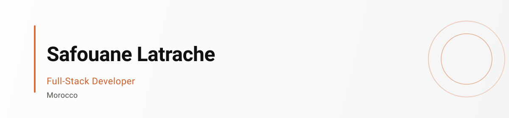
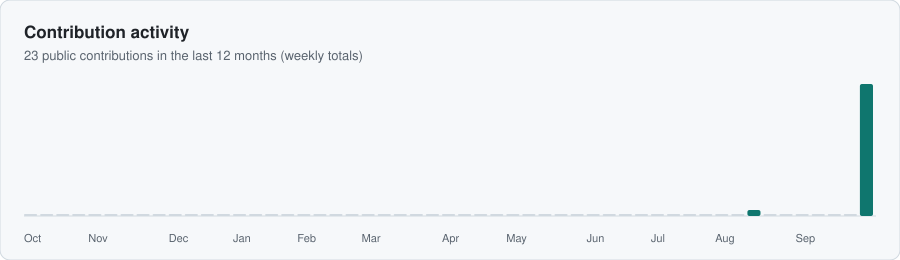
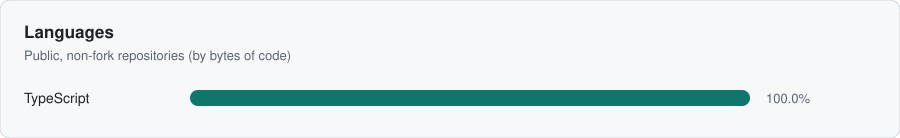
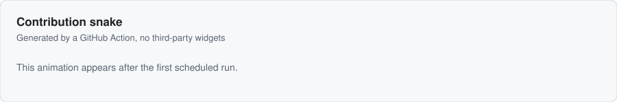

<picture>
  <source media="(prefers-color-scheme: dark)" srcset="banner-dark.svg" />
  
</picture>

  <a href="README.md">English</a> ·
  <a href="README.fr.md">Français</a> ·
  <a href="README.ar.md">العربية</a>

  

## À propos

Développeur full-stack au Maroc. Création d'applications web avec Next.js, TypeScript et Supabase.

Architecture propre, sécurité des types et UX soignée. Travail petit, utile, plutôt que promesses vagues.

Ouvert aux projets freelance. <!-- TODO: ajouter lien de contact quand disponible -->

## Stack

**Core public** — prouvé par les repos publics :  
TypeScript · Node.js · Git

**Utilisés en projets privés** — non vérifiables publiquement :  
React · Next.js · Supabase · Tailwind CSS · PostgreSQL

## En production

### <a href="https://github.com/Saf1thedev/morocco-kit">morocco-kit</a> ★ 1 · v0.1.0

Boîte à outils TypeScript pour le Maroc : validation de téléphone, jours fériés, régions administratives, formatage MAD. Aucune dépendance à l'exécution. Fonctionne dans Node, navigateurs et runtimes edge.

[Docs & playground](https://morocco-kit.vercel.app) · [API](https://morocco-kit.vercel.app/api/v1) · [GitHub](https://github.com/Saf1thedev/morocco-kit)

## Activité

<picture>
  <source media="(prefers-color-scheme: dark)" srcset="graphs/activity-dark.svg" />
  
</picture>

<picture>
  <source media="(prefers-color-scheme: dark)" srcset="graphs/languages-dark.svg" />
  
</picture>

<picture>
  <source media="(prefers-color-scheme: dark)" srcset="graphs/snake-dark.svg" />
  
</picture>

*Graphiques générés quotidiennement via GitHub Actions. Aucun widget tiers.*

## Contact

Aucun lien social public pour l'instant. Ouvrez une issue sur n'importe quel repo pour démarrer la conversation. <!-- TODO: ajouter email professionnel quand disponible -->

---

Safouane Latrache · Maroc · Dernière mise à jour : 2026-10-08