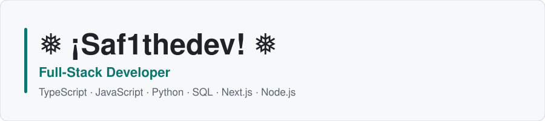

<picture>
  <source media="(prefers-color-scheme: dark)" srcset="assets/banner-dark.svg" />
  
</picture>

  <a href="README.md">English</a> ·
  <a href="README.fr.md">Français</a> ·
  <a href="README.ar.md">العربية</a>

  

# Safouane Latrache

Full-stack developer in Morocco. Building web apps with Next.js, TypeScript & Supabase.

Clean architecture, type safety, and thoughtful UX. Small, useful work over vague claims.

Open to freelance projects. <!-- TODO: add contact link when available -->

## Stack

**Public core** — proven by public repos:  
TypeScript · Node.js · Git

**Used in private projects** — not publicly verifiable:  
React · Next.js · Supabase · Tailwind CSS · PostgreSQL

## Shipping

### <a href="https://github.com/Saf1thedev/morocco-kit">morocco-kit</a> ★ 1 · v0.1.0

TypeScript toolkit for Morocco: phone validation, public holidays, administrative regions, MAD formatting. Zero runtime dependencies. Works in Node, browsers, and edge runtimes.

[GitHub](https://github.com/Saf1thedev/morocco-kit) · [GitHub Release](https://github.com/Saf1thedev/morocco-kit/releases/tag/v0.1.0)

## Activity

<picture>
  <source media="(prefers-color-scheme: dark)" srcset="graphs/activity-dark.svg" />
  
</picture>

<picture>
  <source media="(prefers-color-scheme: dark)" srcset="graphs/languages-dark.svg" />
  
</picture>

<picture>
# Safouane Latrache

Full-stack developer in Morocco. Building web apps with Next.js, TypeScript & Supabase.

Clean architecture, type safety, and thoughtful UX. Small, useful work over vague claims.

Open to freelance projects. <!-- TODO: add contact link when available -->

## Stack

**Public core** — proven by public repos:  
TypeScript · Node.js · Git

**Used in private projects** — not publicly verifiable:  
React · Next.js · Supabase · Tailwind CSS · PostgreSQL

## Shipping

### <a href="https://github.com/Saf1thedev/morocco-kit">morocco-kit</a> ★ 1 · v0.1.0

TypeScript toolkit for Morocco: phone validation, public holidays, administrative regions, MAD formatting. Zero runtime dependencies. Works in Node, browsers, and edge runtimes.

[GitHub](https://github.com/Saf1thedev/morocco-kit) · [GitHub Release](https://github.com/Saf1thedev/morocco-kit/releases/tag/v0.1.0)

## Activity

<picture>
  <source media="(prefers-color-scheme: dark)" srcset="assets/activity-dark.svg" />
  
</picture>

<picture>
  <source media="(prefers-color-scheme: dark)" srcset="assets/languages-dark.svg" />
  
</picture>

<picture>
  <source media="(prefers-color-scheme: dark)" srcset="assets/snake-dark.svg" />
  
</picture>

*Graphs generated daily via GitHub Actions. No third-party widgets.*

## Contact

No public social links yet. Open an issue on any repo to start a conversation. <!-- TODO: add professional email when available -->

---

Safouane Latrache · Morocco

## Momentum

<table>
<tr><td align="center"><b>1</b> repos</td><td align="center"><b>0</b> stars</td><td align="center"><b>2</b> contributions</td></tr>
</table>

## Start a conversation

  

<a href="https://github.com/saf1thedev">GitHub</a>

Safouane Latrache · Founder profile generated with <a href="https://www.gitskins.com/readme-generator">GitSkins</a>

  <source media="(prefers-color-scheme: dark)" srcset="graphs/snake-dark.svg" />
  
</picture>

*Graphs generated daily via GitHub Actions. No third-party widgets.*

## Contact

No public social links yet. Open an issue on any repo to start a conversation. <!-- TODO: add professional email when available -->

---

Safouane Latrache · Morocco