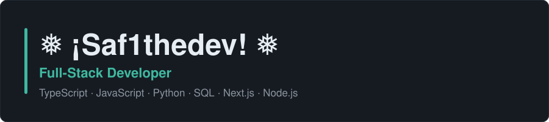
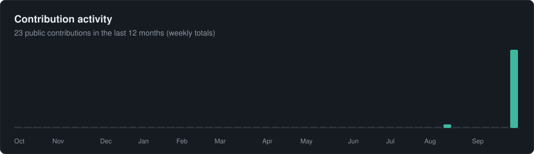
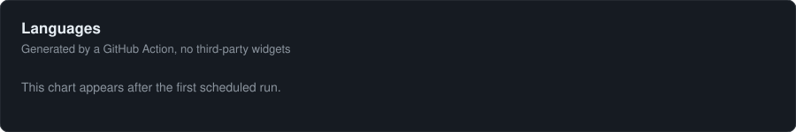

<picture>
  <source media="(prefers-color-scheme: dark)" srcset="assets/banner-dark.svg">
  <source media="(prefers-color-scheme: light)" srcset="assets/banner-light.svg">
  
</picture>

<picture>
  <source media="(prefers-color-scheme: dark)" srcset="assets/typing-dark.svg">
  <source media="(prefers-color-scheme: light)" srcset="assets/typing-light.svg">
  
</picture>

## About

Full-stack developer who takes a product from database schema to polished interface. I design and ship **type-safe**, **performant** and **accessible** web applications with **Next.js**, **TypeScript** and **PostgreSQL**.

- Technologist  Clean, maintainable architecture with end-to-end type safety
- 🔐 Security and data integrity treated as defaults, not afterthoughts
- 🎯 Small, well-documented tools that solve real problems
- 🤝 Open to freelance projects and collaborations

## Languages & Tools

<p>
  
</p>

<p>
  
</p>

## Shipping

### [morocco-kit](https://github.com/Saf1thedev/morocco-kit) · [v0.1.0](https://github.com/Saf1thedev/morocco-kit/releases/tag/v0.1.0)

Open-source TypeScript toolkit for Morocco: phone validation, public holidays, administrative regions and MAD formatting. Zero runtime dependencies, every rule traced to an official source.

```bash
npm i github:Saf1thedev/morocco-kit#v0.1.0
```

<!-- TODO: add the live docs and playground link here once the site is deployed. -->

## Activity

<picture>
  <source media="(prefers-color-scheme: dark)" srcset="graphs/activity-dark.svg">
  <source media="(prefers-color-scheme: light)" srcset="graphs/activity-light.svg">
  
</picture>

<picture>
  <source media="(prefers-color-scheme: dark)" srcset="graphs/languages-dark.svg">
  <source media="(prefers-color-scheme: light)" srcset="graphs/languages-light.svg">
  
</picture>

<picture>
  <source media="(prefers-color-scheme: dark)" srcset="graphs/snake-dark.svg">
  <source media="(prefers-color-scheme: light)" srcset="graphs/snake-light.svg">
  
</picture>

<sub>Activity graphs are generated daily by a GitHub Action.</sub>

## Contact

- Open to project collaborations
- You can reach me through: <a href="https://www.linkedin.com/in/safouane-latrache"></a>

<!-- TODO: add a professional email badge here once it exists. -->
